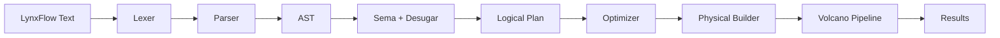

# Query Engine

The LynxDB query engine transforms LynxFlow text into a streaming execution pipeline that can process millions of events per second with minimal memory overhead. It consists of four major stages: the LynxFlow frontend (lexing, parsing, semantic analysis, desugaring), logical planning and optimization, physical pipeline construction, and execution.

## Pipeline Overview



There are two entry points into this flow:

- **Server mode**: `pkg/planner` wraps the frontend and optimizer behind the `Planner` interface used by the REST API.
- **CLI file/pipe mode**: `pkg/lynxflow/run` is a thin orchestrator (parse -> desugar -> lower -> optimize -> build -> drain) used for embedded execution with no server.

Both paths share the same frontend, optimizer, and pipeline -- the difference is only lifecycle and wiring.

:::note Historical note
LynxDB originally shipped an SPL2 dialect. It was replaced by LynxFlow v2 (RFC-002, June 2026) as a clean-break redesign; the old `pkg/spl2` package was removed. The full capability mapping lives in `docs/grammar/RFC-002.md` §15 and the CHANGELOG section "Breaking Changes (LynxFlow vs SPL2)".
:::

## LynxFlow Frontend

The frontend lives under `pkg/lynxflow`. The parser is hand-written recursive descent (no parser generators). This choice gives full control over error messages, error recovery, and performance.

### Lexer

The lexer (`pkg/lynxflow/lexer`) tokenizes the input string into a stream of tokens: stage and clause keywords (`where`, `stats`, `by`), identifiers, string literals, raw strings (`r"..."` for regexes), numbers, durations (`5m`), operators (`>=`, `==`, `??`, `|`), and `$` binding references.

### Recursive Descent Parser

The parser (`pkg/lynxflow/parser`) consumes the token stream and builds an AST (`pkg/lynxflow/ast`). Key characteristics:

- **No backtracking**: The parser makes a single left-to-right pass over the token stream, deciding the production rule based on the current token (LL(1) where possible, with limited lookahead for ambiguous cases).
- **Error recovery**: On syntax errors, the parser attempts to recover by skipping to the next pipe (`|`) operator and continuing to parse subsequent stages. This allows reporting multiple errors in a single parse, rather than stopping at the first one.
- **Caret diagnostics**: Errors carry stable error codes, source spans rendered with caret underlines, and targeted suggestions. For example, `stats count by host` produces `error[E013]: count requires parentheses: count()` with the suggestion `count()`.
- **Registry-driven**: Operator, function, and aggregate signatures come from `pkg/lynxflow/registry` -- the single source of truth also used by semantic analysis, linting, shell syntax highlighting, and the docs generator (`internal/docgen`, which produces `docs/site/docs/lynxflow/**` and `docs/grammar/lynxflow.ebnf`).

### AST

The AST represents a query as a pipeline of stages. Each stage node carries its arguments. For `from main _source=nginx status>=500 | stats count() by uri | sort -count | head 10`:

```
Pipeline [
  From  { source: "main", search: [_source=nginx, status>=500] }
  Stats { aggs: [count()], by: [uri] }
  Sort  { keys: [-count] }
  Head  { n: 10 }
]
```

Named bindings are declared with `let` and substituted wherever referenced:

```
let $threats = from idx_backend | where threat_type in ["sqli", "path_traversal"] | keep client_ip, threat_type;
from $threats | stats count() by threat_type
```

### Semantic Analysis and Desugaring

Two passes run between parsing and lowering:

- **Sema** (`pkg/lynxflow/sema`): Infers the schema flowing through each stage (field names and types), validates stage arguments against the registry, and generates did-you-mean suggestions for misspelled fields and functions.
- **Desugar** (`pkg/lynxflow/desugar`): Rewrites sugar stages onto the core operator set. For example, `every 5m stats count()` desugars to `stats count() by bin(_time, 5m)`, and from-stage search sugar desugars to filters.

### Search Sugar

The `from` stage accepts search sugar -- the only place where `=` compares rather than binds:

- Bare terms: `from main error timeout` (full-text search against `_raw`)
- Quoted phrases: `from main "connection refused"`
- Field comparisons: `from main level=error status>=500`
- Time ranges: `from main[-1h] | where status >= 500 | top 10 uri`

Mid-pipeline, use explicit predicates instead: `where has(_raw, "refused")` or `where contains(_raw, "timeout")`.

## Logical Plan

`pkg/logical` defines the typed logical plan IR. Lowering converts the desugared AST into a tree of plan nodes, where each node represents a relational operator (Scan, Filter, Project, Aggregate, Join, Union, ...) and knows its input children and output schema.

Two design decisions worth noting:

- **Expressions stay as AST nodes**: The bytecode VM compiles directly from `ast.Expr`, so there is no separate expression IR.
- **Relative time bounds stay unresolved**: Time bounds are stored as relative markers (`-1h`), not wall-clock times, making plans deterministic and cacheable regardless of when they were built.

## Optimizer

The optimizer (`pkg/logical/opt`) transforms the logical plan to reduce work at execution time. Rules run in a fixed-point loop with deterministic rule order (up to 10 passes) until no rule fires. Each pass has two phases: expression rules, then plan rules.

### Expression Rules

Applied bottom-up at every expression position in every plan node.

| Rule | Description | Example |
|------|-------------|---------|
| **paren-strip** | Remove redundant parentheses so downstream rules see clean trees | `(x)` becomes `x` |
| **const-fold-arith** | Evaluate constant arithmetic at plan time | `1 + 1` becomes `2` |
| **const-fold-compare** | Evaluate constant comparisons at plan time | `where 1 + 1 > 1` becomes `where true` |
| **bool-simplify** | Apply boolean algebra | `true and p` becomes `p` |
| **coalesce-fold** | Fold `??` chains with constant arms | `null ?? x` becomes `x` |
| **if-fold** | Fold `if()` with a constant condition | `if(true, a, b)` becomes `a` |
| **cmp-normalize** | Normalize comparison shapes | constant moved to the right-hand side |

### Plan Rules

Applied bottom-up over the plan tree.

| Rule | Description | Effect |
|------|-------------|--------|
| **filter-merge** | Merge adjacent Filter nodes into one predicate | One VM program instead of two |
| **filter-elim** | Remove always-true filters | Dead operator removed |
| **filter-false-to-empty** | Replace always-false filters with an empty source | No scan at all |
| **predicate-pushdown** | Move filters past non-filtering operators toward the scan | Fewer events reach expensive operators |
| **partial-agg** | Split aggregation into per-segment partial phase and global merge phase | Reduces memory, enables distributed execution |
| **topk-into-agg** | When `stats` is followed by `sort` + `head`, push the limit into a heap-based TopK aggregation | Avoids full sort for "top N" queries |
| **tail-scan** | Push `tail N` into the scan | Read from the end instead of materializing everything |
| **limit-pushdown** | Push `head` limits toward the scan | Short-circuit earlier |
| **column-pruning** | Remove columns never referenced downstream | Reduce memory and I/O |
| **mv-rewrite** | Detect queries satisfiable by a materialized view and rewrite the scan to read from the view | ~400x speedup |

### Scan-Time Pruning

Predicates pushed into the Scan node drive pruning when the physical scan reads segments:

| Technique | Description | Effect |
|-----------|-------------|--------|
| **Time range pruning** | Time bounds from `from main[-1h]` or `_time` predicates prune segments by time range | Skip segments outside the query window |
| **Bloom filter pruning** | Literal search terms are checked against per-segment bloom filters | Skip segments that definitely do not contain the term |
| **Inverted index lookup** | Full-text search resolves to inverted index lookups | Read only matching rows, not the whole segment |
| **Interpolation search** | Interpolation search instead of binary search on sorted timestamp columns | 4.4x faster than binary search (1.8ns vs 15ns) |

## Physical Pipeline Builder

The physical builder (`pkg/logical/physical`) converts the optimized logical plan into a tree of streaming operators from `pkg/engine/pipeline`, compiling every expression (filters, extend assignments, aggregation arguments) into `pkg/vm` bytecode programs along the way.

## Volcano Iterator Pipeline

The execution engine uses the Volcano iterator model: a tree of operators where each operator implements a `Next()` method that pulls the next batch of results from its child operator.

### Pull-Based Streaming

```
Output
  ↑ Next()
Sort
  ↑ Next()
Aggregate (global merge)
  ↑ Next()
Filter (where status >= 500)
  ↑ Next()
Scan (segments + buffered/in-memory events)
```

Each `Next()` call returns a batch of up to 1024 rows. This design has critical advantages for log analytics:

- **Short-circuit**: `head 10` on 100M events reads only enough batches to fill 10 results (0.23 ms), not the entire dataset.
- **Bounded memory**: Each operator holds at most one batch in memory. A pipeline scanning 100 GB of segments uses a few MB of memory.
- **Composable**: Operators are independent and composable. Adding a new stage means implementing one `Next()` method.

### Pipeline Operators

| Operator | LynxFlow Stage | Description |
|----------|---------------|-------------|
| **Scan** | `from` (incl. search sugar) | Reads events from segments and buffered/in-memory event stores. Applies time/bloom/index pruning. |
| **Filter** | `where` | Evaluates a boolean predicate via the bytecode VM. |
| **Project** | `keep`, `drop` | Selects or removes columns. |
| **Eval** | `extend` | Computes new fields using the bytecode VM. |
| **Aggregate** | `stats` | Hash-based aggregation with partial/global merge support. |
| **Sort** | `sort` | In-memory sort with spill-to-disk for large result sets. |
| **Limit** | `head`, `tail` | Limits the number of output rows. |
| **Parse** | `parse json`, `parse logfmt`, `parse regex` | Structure extraction at query time. |
| **StreamStats** | `streamstats` | Running aggregation over the event stream. |
| **EventStats** | `eventstats` | Aggregation appended to each event (no reduction). |
| **Join** | `join` | Hash join between two datasets. |
| **Union** | `union` | Concatenates multiple datasets. |
| **Dedup** | `dedup` | Removes duplicate events by specified fields. |
| **Rename** | `rename` | Renames fields. |
| **Top/Rare** | `top`, `rare` | Heap-based most/least frequent values. |
| **Transaction** | `transaction` | Groups events into transactions by correlation fields. |
| **Live scan** | Live tail | Streams events as they arrive (SSE). |

Sugar stages (`every`, `baseline`, `changes`, `rate`, ...) desugar onto these core operators before lowering. The full registry-generated stage catalog lives in the [LynxFlow reference](/docs/lynxflow/overview).

## Bytecode VM

The bytecode VM evaluates expressions in `where`, `extend`, and `stats` stages. It is designed for extreme throughput on the hot path.

### Architecture

```
┌────────────────────────────────────┐
│          Bytecode Program          │
│  [LOAD_FIELD "status"]            │
│  [PUSH_INT 500]                   │
│  [CMP_GE]                         │
│  [HALT]                           │
├────────────────────────────────────┤
│          Execution Stack           │
│  Fixed 256 slots (no heap alloc)  │
│  [slot 0: field value]            │
│  [slot 1: constant 500]           │
│  [slot 2: comparison result]      │
├────────────────────────────────────┤
│          Field Resolver            │
│  Maps field names → column index  │
│  + current row pointer            │
└────────────────────────────────────┘
```

### Design Principles

- **Zero allocations**: The stack is a fixed-size array (256 slots) allocated once per query, not per event. No heap allocations occur during evaluation.
- **Stack-based**: Operations push and pop values on the stack. `LOAD_FIELD "status"` pushes the field value; `PUSH_INT 500` pushes the constant; `CMP_GE` pops both and pushes the boolean result.
- **Compact bytecode**: Each opcode is a single byte. The program for `status >= 500` is 4 instructions (~12 bytes).

### Opcodes (60+)

The VM supports 60+ opcodes across several categories:

| Category | Examples |
|----------|---------|
| **Stack** | `PUSH_INT`, `PUSH_FLOAT`, `PUSH_STRING`, `PUSH_BOOL`, `PUSH_NULL`, `POP`, `DUP` |
| **Field** | `LOAD_FIELD`, `STORE_FIELD` |
| **Arithmetic** | `ADD`, `SUB`, `MUL`, `DIV`, `MOD`, `NEG` |
| **Comparison** | `CMP_EQ`, `CMP_NE`, `CMP_LT`, `CMP_LE`, `CMP_GT`, `CMP_GE` |
| **Boolean** | `AND`, `OR`, `NOT` |
| **String** | `CONCAT`, `LOWER`, `UPPER`, `SUBSTR`, `LEN`, `MATCH` (regex) |
| **Type** | `TO_NUMBER`, `TO_STRING`, `IS_NULL`, `IS_NOT_NULL`, `COALESCE` |
| **Control** | `JUMP`, `JUMP_IF_FALSE`, `JUMP_IF_TRUE`, `HALT` |
| **Functions** | `CALL_IF`, `CALL_CASE`, `CALL_ROUND`, `CALL_LN`, `CALL_STRFTIME`, ... |

### Performance

| Expression | Latency | Allocations |
|-----------|---------|-------------|
| `status >= 500` | 22 ns/op | 0 |
| `status >= 500 and host == "web-01"` | 55 ns/op | 0 |
| `if(status >= 500, "error", "ok")` | ~40 ns/op | 0 |
| `round(duration_ms / 1000, 2)` | ~35 ns/op | 0 |

At 22 ns/op, the VM can evaluate ~45 million predicates per second on a single core. In practice, I/O and pipeline overhead dominate, but the VM is never the bottleneck.

## Segment Query Cache

The query engine includes a filesystem-based segment cache that memoizes query results per segment:

- **Key**: `(segment_id, CRC32, query_hash, time_range)` -- ensures cache correctness even if the segment is rewritten by compaction.
- **Value**: Serialized partial result (e.g., partial aggregation state).
- **Eviction**: TTL (configurable) + LRU when the cache exceeds the size limit.
- **Persistence**: The cache is stored on the filesystem and survives restarts.

### Cache Hit Flow

```
Query: "from main level=error | stats count() by source"

Segment seg_001:
  cache key = hash(seg_001, crc32, query_hash, time_range)
  → cache HIT (299ns) → return cached partial agg

Segment seg_002:
  cache key = hash(seg_002, crc32, query_hash, time_range)
  → cache MISS → scan segment → compute partial agg → cache result → return

Global merge: merge partial aggs from all segments → final result
```

For repeated queries (scheduled reports, dashboards), the cache turns segment scans into sub-microsecond lookups.

## Partial Aggregation

Partial aggregation is a two-phase execution strategy that reduces memory usage and enables distributed query execution:

### Phase 1: Per-Segment Partial

Each segment produces a partial aggregation result. For `stats count(), avg(duration) by source`:

- Each segment computes `{source: "nginx", count: 142, sum_duration: 15432.5, count_duration: 142}` locally.

### Phase 2: Global Merge

The coordinator merges all partial results:

- `count()` = sum of all partial counts
- `avg(duration)` = sum of all `sum_duration` / sum of all `count_duration`

This works because count and sum are associative and commutative. All aggregation functions in LynxDB implement partial and merge semantics.

In distributed mode, Phase 1 runs on shard nodes and Phase 2 runs on the coordinator. See [Distributed Architecture](/docs/architecture/distributed).

## Related

- [Architecture Overview](/docs/architecture/overview) -- system-level view
- [Segment Format](/docs/architecture/segment-format) -- how the scan operator reads `.lsg` files
- [Indexing](/docs/architecture/indexing) -- bloom filters and inverted index integration
- [LynxFlow Reference](/docs/lynxflow/overview) -- the query language that the parser implements
- [Design Decisions](/docs/architecture/design-decisions) -- why Volcano, why a bytecode VM
