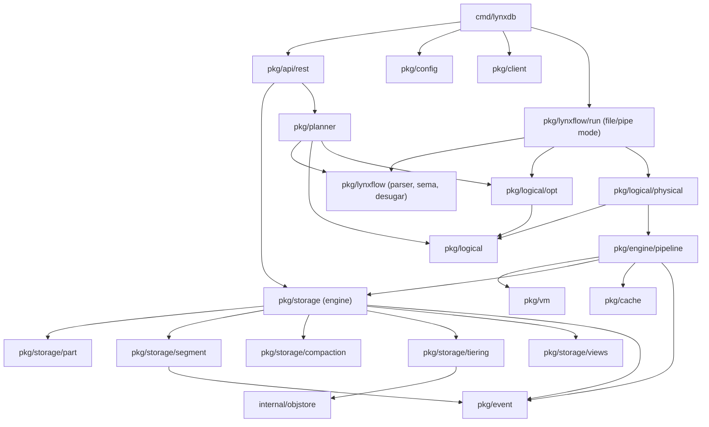

# Project Structure

LynxDB follows standard Go project layout conventions. This page describes every package and its role in the system.

## Top-Level Layout

```
lynxdb/
├── cmd/lynxdb/           # CLI entry point
├── pkg/                  # Public packages (the core of LynxDB)
├── internal/             # Private packages (not importable outside the module)
├── test/                 # Test suites
├── docs/                 # Documentation site (Docusaurus)
├── go.mod                # Go module definition
├── go.sum                # Dependency checksums
└── Makefile              # Build and test targets
```

## `cmd/lynxdb/` -- CLI Entry Point

The `cmd/lynxdb/` directory contains the `main` package and the CLI command definitions. Each subcommand (`server`, `query`, `ingest`, `status`, `mv`, `config`, `bench`, `demo`) is defined here and delegates to the appropriate `pkg/` package.

```
cmd/lynxdb/
├── main.go               # Entry point, root command
├── server.go             # `lynxdb server` command
├── query.go              # `lynxdb query` command
├── ingest.go             # `lynxdb ingest` command
├── status.go             # `lynxdb status` command
├── mv.go                 # `lynxdb mv` (materialized views) command
├── config.go             # `lynxdb config` command
├── bench.go              # `lynxdb bench` command
├── demo.go               # `lynxdb demo` command
└── completion.go         # Shell completion generation
```

This layer is intentionally thin -- it parses flags, sets up configuration, and calls into `pkg/`.

## `pkg/` -- Core Packages

### `pkg/api/rest/` -- HTTP Server and REST API

The REST API layer. Contains the HTTP server, all endpoint handlers, middleware (auth, logging, rate limiting), and the response envelope format.

Key responsibilities:
- HTTP server lifecycle (start, shutdown, TLS).
- Route registration for all `/api/v1/` endpoints.
- Request parsing and validation.
- Response serialization (JSON, NDJSON, SSE).
- The compatibility layer (Elasticsearch `_bulk`, OTLP, Splunk HEC).

See [REST API Overview](/docs/api/overview) for the user-facing API documentation.

### `pkg/lynxflow/` -- LynxFlow Query Language

The LynxFlow v2 frontend: lexer, parser, AST, semantic analysis, desugaring, and the registry that defines the language surface. (The old `pkg/spl2` package was removed when LynxFlow v2 replaced the SPL2 dialect -- see `docs/grammar/RFC-002.md`.)

```
pkg/lynxflow/
├── lexer/                # Tokenizer
├── parser/               # Recursive descent parser with caret diagnostics
├── ast/                  # AST node types
├── sema/                 # Semantic analysis, schema inference, suggestions
├── desugar/              # Sugar stages → core operator rewrites
├── registry/             # Operator/function/aggregate catalog (single source of truth)
├── lint/                 # Query linting
├── format/               # Query formatting
└── run/                  # Embedded execution for CLI file/pipe mode
```

Key responsibilities:
- Convert LynxFlow text to a typed AST.
- Error recovery (report multiple errors per query) with error codes, caret spans, and suggestions.
- Infer the schema flowing through each stage and validate arguments against the registry.
- Desugar sugar stages (`every`, `top`, search sugar, ...) onto the core operator set.

The registry is the single source of truth for the language surface: the parser, sema, shell highlighting, and the docs generator (`internal/docgen`) all read from it.

See [Query Engine](/docs/architecture/query-engine) for how the frontend fits into the query pipeline.

### `pkg/logical/` -- Logical Plan IR and Optimizer

The typed logical plan IR, lowering from the desugared AST, and plan optimization.

```
pkg/logical/
├── lower.go              # Desugared AST → logical plan lowering
├── node.go, plan.go      # Plan node types (Scan, Filter, Project, Aggregate, ...)
├── render.go             # Plan rendering
├── explain/              # EXPLAIN output from the logical plan
├── opt/                  # Rule-based fixed-point optimizer (expression + plan rules)
└── physical/             # Physical pipeline builder (plan → pipeline operators + VM programs)
```

Key responsibilities of `pkg/logical/opt`:
- Expression simplification (constant folding, boolean algebra, `??`/`if()` folding).
- Filter merge/elimination and predicate pushdown.
- Aggregation optimization (partial aggregation, TopK pushdown).
- Limit pushdown and column pruning.
- Materialized view rewrite.

See [Query Engine -- Optimizer](/docs/architecture/query-engine#optimizer) for the full rule list.

### `pkg/planner/` -- Server-Side Query Planning

A thin wrapper around the LynxFlow parser, desugarer, semantic analyzer, and logical optimizer. It presents the `Planner` interface that the server stack (REST API) uses to plan queries. CLI file/pipe mode uses `pkg/lynxflow/run` instead.

### `pkg/langdetect/` -- Language Validation

Post-SPL2-removal shim: the only supported language is LynxFlow. Validates an explicit `language` parameter and returns an explicit error for `spl2`.

### `pkg/sigmaqueries/` -- Sigma Compatibility Corpus

The Sigma/rsigma compatibility corpus with `.lynxflow` golden queries and tests.

### `pkg/engine/pipeline/` -- Volcano Iterator Pipeline

The streaming query execution engine. Implements the Volcano iterator model. Representative files (the package contains many more operators and their tests):

```
pkg/engine/pipeline/
├── iterator.go           # Operator interface and iterator plumbing
├── batch.go              # Row batches (1024 rows per Next())
├── from.go               # Scan entry (reads .lsg parts + batcher buffer)
├── rowscan.go            # Row-oriented scan
├── columnar_scan.go      # Columnar scan
├── livescan.go           # Live tail streaming scan (SSE)
├── eval.go               # Eval operator (extend)
├── aggregate.go          # Aggregate operator (stats)
├── partial_agg.go        # Partial aggregation (per-segment partial + merge)
├── sort.go               # Sort operator (sort), spill-to-disk in spill.go
├── limit.go              # Limit operator (head)
├── parse_iterator.go     # Parse operator (parse json / logfmt / regex)
├── streamstats.go        # StreamStats operator (streamstats)
├── eventstats.go         # EventStats operator (eventstats)
├── join.go               # Join operator (join)
├── union.go              # Union operator (union)
├── dedup.go              # Dedup operator (dedup)
├── rename.go             # Rename operator (rename)
├── top.go                # Top/Rare operator (top, rare)
├── transaction.go        # Transaction operator (transaction)
└── tee.go                # Tee sink (tee, CLI mode only)
```

Each operator implements the `Operator` interface with a `Next()` method that returns the next batch of rows. Aggregation functions (`count()`, `avg`, `dc`, `perc`, ...) are implemented here with partial/merge semantics for distributed execution; their signatures are declared in `pkg/lynxflow/registry`.

### `pkg/vm/` -- Bytecode VM

The stack-based bytecode VM for evaluating expressions in `where`, `extend`, and `stats` stages.

Key responsibilities:
- Compile AST expressions to bytecode programs.
- Execute bytecode with zero heap allocations.
- 60+ opcodes for arithmetic, comparison, boolean logic, string operations, and function calls.

See [Query Engine -- Bytecode VM](/docs/architecture/query-engine#bytecode-vm) for architecture details.

### `pkg/storage/` -- Storage Engine

The core storage engine package. Contains the top-level `Engine` type that coordinates async ingest buffering, immutable part files, segment management, compaction, and tiering.

```
pkg/storage/
├── part/                 # Async batcher, part writer, and filesystem registry
├── segment/              # Columnar .lsg format
├── compaction/           # Size-tiered compaction
├── tiering/              # Hot/warm/cold with S3 offload
└── views/                # Materialized views
```

#### `pkg/storage/segment/` -- Segment Reader and Writer

The columnar `.lsg` segment format implementation.

Key files:
- `writer.go` -- Segment writer (always produces V2 format).
- `reader.go` -- Segment reader (accepts V1 and V2).
- `mmap.go` -- Memory-mapped segment access via `MmapSegment`.
- `encoding.go` -- Per-column encoding (delta-varint, dictionary, Gorilla, LZ4).
- `bloom.go` -- Bloom filter construction and querying.
- `index.go` -- FST inverted index construction and querying.
- `footer.go` -- Footer decoding (`decodeFooter` returns `(*Footer, uint16, error)`).

See [Segment Format](/docs/architecture/segment-format) for the binary format specification.

#### `pkg/storage/part/` -- Direct-to-Part Writes

Implements the async batcher, immutable part writer, and filesystem-scanned registry used by the current ingest path.

#### `pkg/storage/compaction/` -- Compaction

Size-tiered compaction engine. Merges L0 -> L1 -> L2 segments. Rate-limited to avoid I/O starvation.

#### `pkg/storage/tiering/` -- Tiered Storage

Manages the lifecycle of segments across storage tiers: hot (local SSD), warm (S3), cold (Glacier). Includes the local segment cache for warm-tier queries.

#### `pkg/storage/views/` -- Materialized Views

Materialized view lifecycle: definition, query dispatch, backfill, incremental update, merge, and retention.

### `pkg/event/` -- Core Event Type

Defines the `Event` type (the unit of data flowing through the system) and an event pool for allocation reuse.

### `pkg/model/` -- Configuration and Errors

Shared types for configuration, index definitions, and structured error types.

### `pkg/config/` -- Configuration Loading

Loads configuration from the cascade: CLI flags > environment variables > config file > defaults. Supports hot-reload for a subset of settings.

### `pkg/cache/` -- Segment Query Cache

Filesystem-based segment query cache. Key = `(segment_id, CRC32, query_hash, time_range)`. TTL + LRU eviction. Persistent across restarts.

### `pkg/ingest/` -- Ingest Pipeline

```
pkg/ingest/
├── pipeline/             # Ingest pipeline (parse, extract timestamps, route)
├── receiver/             # HTTP and OTLP receivers
└── parser/               # Log format auto-detection (JSON, syslog, CLF, raw)
```

Handles the ingest path from raw bytes to structured events ready for the storage engine.

### `pkg/client/` -- Go Client Library

A Go HTTP client for the LynxDB REST API. Used by the CLI in server mode and available for external integrations.

### `pkg/timerange/` -- Time Range Utilities

Parsing and manipulation of time ranges. Handles relative expressions (`-1h`, `earliest=-7d latest=now`) and absolute timestamps.

## `internal/` -- Private Packages

### `internal/docgen/` -- Docs Generator

Generates the registry-driven language reference (`docs/site/docs/lynxflow/**`) and the EBNF grammar (`docs/grammar/lynxflow.ebnf`) from `pkg/lynxflow/registry`. Run with `go run ./internal/docgen` or `make docs-gen`.

### `internal/objstore/` -- Object Store Interface

The `ObjectStore` interface abstracts object storage. Two implementations:

- `MemStore` -- In-memory implementation for testing.
- `S3Store` -- Production implementation backed by AWS S3 (or S3-compatible APIs like MinIO).

### `internal/output/` -- CLI Output Formatting

Formatters for CLI output: JSON (default), table (human-readable), CSV, and raw (plain text). Auto-detects TTY vs pipe to choose between interactive and machine-readable formats.

## `test/` -- Test Suites

```
test/
├── e2e/                  # End-to-end HTTP API tests (ingest, query, tail, views, compat)
├── cli/                  # CLI tests against the built binary (pipe/file mode, exit codes, goldens)
├── integration/          # Cluster and Sigma-compatibility integration tests
├── regression/           # Query correctness regression tests
├── chaos/                # Fault-injection tests (Docker-based)
└── simulation/           # Property-based cluster/network/S3 simulation tests
```

- **E2E tests**: Start a real server and exercise the REST API end to end (`make test-e2e`).
- **CLI tests**: Invoke the `lynxdb` binary as a subprocess and verify output, exit codes, and golden files (`make test-cli`).
- **Integration tests**: Cluster behavior and the Sigma compatibility corpus.
- **Regression tests**: Each test corresponds to a specific bug fix and ensures the bug does not reappear.
- **Chaos and simulation tests**: Fault injection and property-based simulation of cluster components.

## Dependency Graph

The following diagram shows the primary dependency relationships between core packages:



## Related

- [Development Setup](/docs/contributing/development-setup) -- build and run the project
- [Coding Guidelines](/docs/contributing/coding-guidelines) -- style conventions
- [Architecture Overview](/docs/architecture/overview) -- how the system fits together
